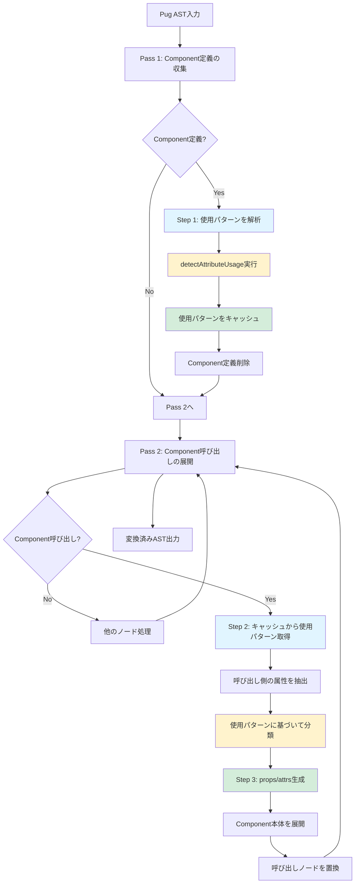
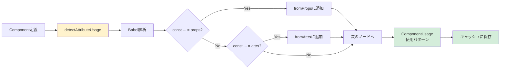
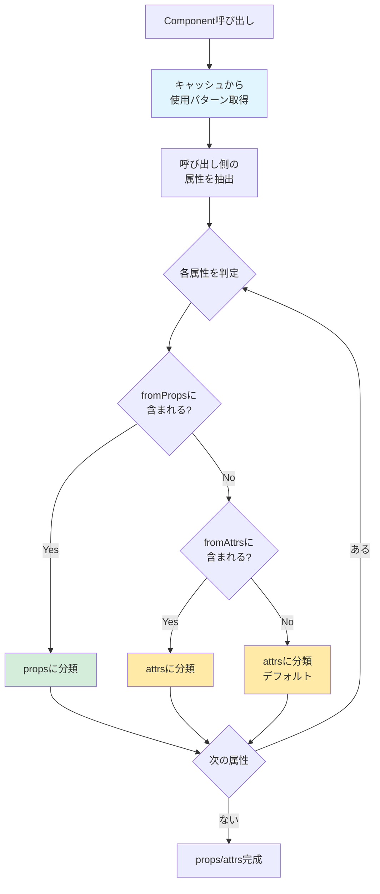
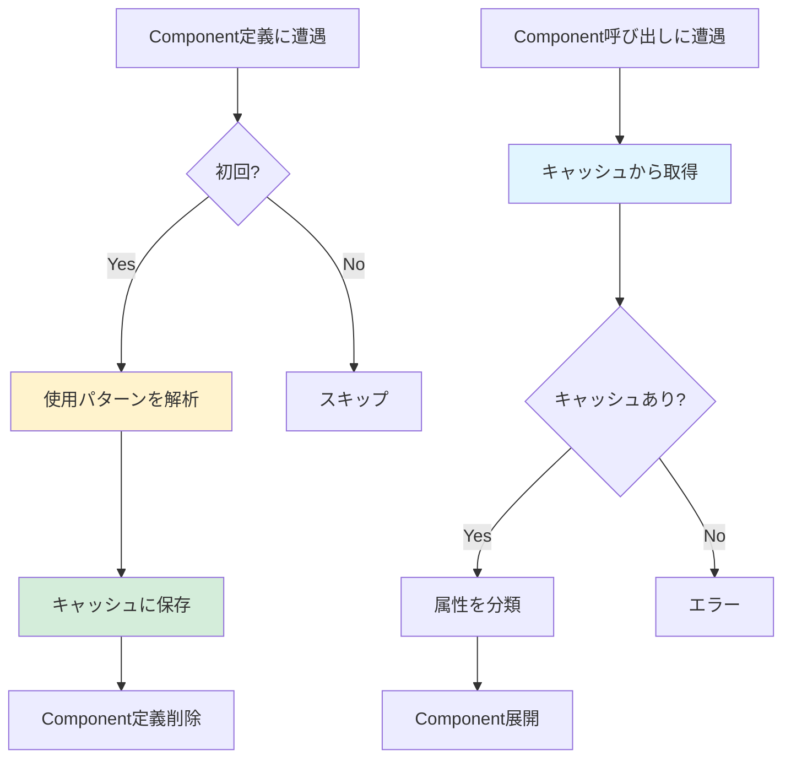

# Phase 3 実装計画

Phase 3（props/attrs識別子の導入）の詳細な実装計画書です。

---

## 📋 目標

`props` と `attrs` 識別子を導入し、プロパティと属性を明確に分離します。
Component内での**使用宣言**に基づいて、pug-tailが呼び出し側の属性を自動的にprops/attrsに分類します。
JavaScript標準の機能のみを使用し、シンプルで実用的なAPIを提供します。

### ⚠️ 重要な概念

**これは「定義」ではなく「使用による推論」です**

```pug
component Card()
  - const { title, count } = props  
  // ↑ これはpropsの「定義」ではない
  // ↑ 「Component内でpropsからtitleとcountを使う」という宣言
  
  - const { class: className } = attrs
  // ↑ これもattrsの「定義」ではない
  // ↑ 「Component内でattrsからclassを使う」という宣言
  
  .card(class=className)
    h2= title
```

**pug-tailの動作フロー**:
1. **Component定義を解析**: 「このComponentはpropsから`title`/`count`、attrsから`class`を使う」
2. **呼び出し側で自動判別**: `Card(title="A", count=1, class="x")` → 使用パターンに基づいて分類
3. **自動生成**: `var props = {...}` と `var attrs = {...}` を生成

**Vue 3との比較**:
| | Vue 3 | pug-tail Phase 3 |
|---|---|---|
| アプローチ | 明示的な定義 | 使用による推論 |
| 方法 | `defineProps({...})` | `const {...} = props` |
| propsの決定 | 定義時に確定 | 使用パターンから推論 |
| 学習コスト | 新しい概念 | JavaScript標準のみ |

---

## 🎯 設計原則

1. **シンプル**: 新しい構文を導入しない（JavaScript標準のみ）
2. **明確**: props と attrs の区別を明示的にする
3. **ゼロランタイム**: ビルド時に完全展開
4. **効率的**: Component定義の解析は1回のみ（キャッシング）
5. **推論ベース**: 使用パターンから自動判別（定義不要）

---

## 🔄 処理フロー全体像



**重要なポイント**:
- Step 1で「何が使われるか」を解析（定義ではない）
- Step 2で使用パターンに基づいて自動分類
- 開発者は定義を書く必要がない

---

## 📐 詳細設計

### Step 1: 使用パターンの解析（1回のみ）

**目的**: Component内でprops/attrsから**何が使われているか**を検出



**入力例**:
```pug
component Card()
  - const { title, count } = props  // ← 使用宣言
  - const { class: className = "card" } = attrs  // ← 使用宣言
  
  .card(class=className)
    h2= title
    p Count: #{count}
```

**解析結果（使用パターン）**:
```typescript
{
  fromProps: ['title', 'count'],  // propsから使用される属性
  fromAttrs: ['class']            // attrsから使用される属性
}
```

**実装**:
```typescript
interface ComponentUsage {
  fromProps: string[]   // propsから使用される属性リスト
  fromAttrs: string[]   // attrsから使用される属性リスト
}

function detectAttributeUsage(componentBody: Block): ComponentUsage {
  const fromProps: string[] = []
  const fromAttrs: string[] = []
  
  walk(componentBody, (node) => {
    if (node.type === 'Code') {
      const code = node.val
      
      // "const { title, count } = props" を検出
      // → propsから使用される属性を記録
      if (code.includes('= props')) {
        const vars = extractDestructuredVars(code)
        fromProps.push(...vars)
      }
      
      // "const { class: className } = attrs" を検出
      // → attrsから使用される属性を記録
      if (code.includes('= attrs')) {
        const vars = extractDestructuredVars(code)
        fromAttrs.push(...vars)
      }
    }
  })
  
  return { fromProps, fromAttrs }
}
```

---

### Step 2: 呼び出し側の属性分類（呼び出しごと）

**目的**: 使用パターンに基づいて、呼び出し側の属性をprops/attrsに自動分類



**例1: すべて指定**
```pug
Card(title="Hello", count=5, class="my-card", id="card-1")
```

使用パターン: `{ fromProps: ['title', 'count'], fromAttrs: ['class'] }`

↓ 自動分類

```typescript
props = { title: "Hello", count: 5 }      // fromPropsに含まれる
attrs = { class: "my-card", id: "card-1" } // fromAttrs + 想定外（デフォルトでattrs）
```

**例2: 一部省略（デフォルト値が適用される）**
```pug
Card(title="World")
```

↓ 自動分類

```typescript
props = { title: "World" }  // countは渡されていない → デフォルト値が適用される
attrs = {}                  // classは渡されていない → デフォルト値が適用される
```

**例3: 想定外の属性（安全に処理）**
```pug
Card(title="Test", data-test="card-test")
```

↓ 自動分類

```typescript
props = { title: "Test" }                   // fromPropsに含まれる
attrs = { "data-test": "card-test" }        // 想定外 → デフォルトでattrs
```

**実装**:
```typescript
function categorizeAttributes(
  callAttributes: Map<string, string>,
  usage: ComponentUsage  // 使用パターン
): { props: Map<string, string>, attrs: Map<string, string> } {
  const props = new Map()
  const attrs = new Map()
  
  // 使用パターンに基づいて自動分類
  for (const [key, value] of callAttributes) {
    if (usage.fromProps.includes(key)) {
      // Component内でpropsから使用される
      props.set(key, value)
    } else if (usage.fromAttrs.includes(key)) {
      // Component内でattrsから使用される
      attrs.set(key, value)
    } else {
      // 想定外の属性 → デフォルトでattrs（自動フォールスルー）
      attrs.set(key, value)
    }
  }
  
  return { props, attrs }
}
```

---

### Step 3: props/attrsコードの生成

**目的**: Component本体の先頭にprops/attrsオブジェクトを生成するコードを挿入

```mermaid
flowchart LR
    A[分類済み<br/>props/attrs] --> B[createPropsCode]
    A --> C[createAttrsCode]
    B --> D[var props = {...}]
    C --> E[var attrs = {...}]
    D --> F[Component本体の<br/>先頭に挿入]
    E --> F
    F --> G[展開済みComponent]
    
    style B fill:#fff3cd
    style C fill:#fff3cd
    style F fill:#d4edda
```

**生成されるコード**:
```javascript
// Phase 3が自動生成（開発者は書かない）
var props = { "title": "Hello", "count": 5 }
var attrs = { "class": "my-card" }

// 開発者が書いたコード（そのまま）
const { title, count = 0 } = props          // propsから取得
const { class: className = "card" } = attrs // attrsから取得

// テンプレート展開
// .card(class=className) → <div class="my-card">
//   h2= title → <h2>Hello</h2>
```

**実装**:
```typescript
function createPropsCode(props: Map<string, string>): Code {
  const pairs = Array.from(props.entries())
    .map(([key, value]) => `"${key}": ${value}`)
    .join(', ')
  
  return {
    type: 'Code',
    val: `var props = {${pairs}}`,
    buffer: false,
    mustEscape: false,
    isInline: false,
  }
}

function createAttrsCode(attrs: Map<string, string>): Code {
  const pairs = Array.from(attrs.entries())
    .map(([key, value]) => `"${key}": ${value}`)
    .join(', ')
  
  return {
    type: 'Code',
    val: `var attrs = {${pairs}}`,
    buffer: false,
    mustEscape: false,
    isInline: false,
  }
}
```

---

## 🔧 Babel統合

### extractDestructuredVars実装

**目的**: 分割代入から変数名を抽出（リネーム対応）

```mermaid
flowchart TD
    A[JavaScriptコード] --> B[@babel/parser]
    B --> C[AST生成]
    C --> D[@babel/traverse]
    D --> E{VariableDeclarator?}
    E -->|Yes| F{ObjectPattern?}
    E -->|No| D
    F -->|Yes| G[各propertyを処理]
    F -->|No| D
    G --> H{ObjectProperty?}
    H -->|Yes| I[キー名を抽出]
    H -->|No| D
    I --> J[変数リストに追加]
    J --> D
    D --> K[抽出完了]
    
    style B fill:#fff3cd
    style D fill:#fff3cd
    style I fill:#d4edda
```

**対応する構文**:
```javascript
// ✅ 基本的な分割代入
const { title } = props
// → ['title']

// ✅ デフォルト値
const { title = "Default" } = props
// → ['title']

// ✅ リネーム
const { class: className } = attrs
// → ['class']  ← 元のキー名を記録

// ✅ 複合
const { title = "Default", class: className = "card" } = props
// → ['title', 'class']
```

**実装**:
```typescript
import { parse } from '@babel/parser'
import traverse from '@babel/traverse'

function extractDestructuredVars(code: string): string[] {
  const ast = parse(code, {
    sourceType: 'module',
    plugins: ['typescript']
  })
  
  const vars: string[] = []
  
  traverse.default(ast, {
    VariableDeclarator(path) {
      if (path.node.id.type === 'ObjectPattern') {
        path.node.id.properties.forEach(prop => {
          if (prop.type === 'ObjectProperty') {
            // 元のキー名を記録（リネーム対応）
            const keyName = prop.key.type === 'Identifier' 
              ? prop.key.name 
              : prop.key.value
            vars.push(keyName)
          }
        })
      }
    }
  })
  
  return vars
}
```

---

## 💾 キャッシング戦略

### 重複実行の回避

**なぜキャッシングが必要か**:
- Component定義は1つだが、呼び出しは複数存在する
- 使用パターンの解析（Step 1）は重い処理
- 同じ解析を何度も実行するのは非効率



**実装**:
```typescript
class ASTTransformer {
  // キャッシュ: Component名 → 使用パターン
  private componentUsageCache = new Map<string, ComponentUsage>()
  
  transform(ast: Block): Block {
    // Pass 1: Component定義を収集（一度だけ）
    walk(ast, (node) => {
      if (this.isComponentDefinition(node)) {
        const { name, body } = this.parseComponentDefinition(node)
        
        // ✅ 使用パターンを解析してキャッシュ（1回のみ）
        const usage = detectAttributeUsage(body)
        this.componentUsageCache.set(name, usage)
        
        this.removeNode(node)
      }
    })
    
    // Pass 2: Component呼び出しを展開（呼び出しごと）
    walk(ast, (node) => {
      if (this.isComponentCall(node)) {
        const name = node.name
        
        // ✅ キャッシュから取得（重複実行なし）
        const usage = this.componentUsageCache.get(name)
        if (!usage) {
          throw new Error(`Component "${name}" not found`)
        }
        
        // Step 2-3を実行
        const expanded = this.expandComponent(name, node, usage)
        this.replaceNode(node, expanded)
      }
    })
    
    return ast
  }
}
```

**処理回数の比較**:

```
Component定義: 1個
Component呼び出し: 10箇所

❌ キャッシングなし:
  detectAttributeUsage: 10回実行（非効率）
  合計: 10回の重い処理

✅ キャッシングあり:
  detectAttributeUsage: 1回実行（効率的）
  キャッシュ取得: 10回（高速）
  合計: 1回の重い処理 + 10回の軽い処理
```

---

## 📊 具体例: 複数呼び出しの処理

### Component定義

```pug
component Card()
  - const { title, count = 0 } = props
  - const { class: className = "card" } = attrs
  
  .card(class=className)
    h2= title
    p Count: #{count}
```

**Step 1の実行（1回のみ）**:
```typescript
// 使用パターンを解析してキャッシュに保存
componentUsageCache.set('Card', {
  fromProps: ['title', 'count'],
  fromAttrs: ['class']
})
```

---

### 呼び出し1: 完全指定

```pug
Card(title="Hello", count=5, class="my-card", id="card-1")
```

**Step 2-3の実行**:
```typescript
// キャッシュから使用パターンを取得
usage = { fromProps: ['title', 'count'], fromAttrs: ['class'] }

// 使用パターンに基づいて自動分類
props = { title: "Hello", count: 5 }        // fromPropsに含まれる
attrs = { class: "my-card", id: "card-1" }  // fromAttrs + 想定外

// 自動生成
var props = { "title": "Hello", "count": 5 }
var attrs = { "class": "my-card", "id": "card-1" }
```

**結果**:
```html
<div class="card my-card" id="card-1">
  <h2>Hello</h2>
  <p>Count: 5</p>
</div>
```

---

### 呼び出し2: 一部省略

```pug
Card(title="World")
```

**Step 2-3の実行**:
```typescript
// 同じキャッシュを使用（重複実行なし）
usage = { fromProps: ['title', 'count'], fromAttrs: ['class'] }

// 自動分類
props = { title: "World" }  // countは渡されていない
attrs = {}                  // classは渡されていない

// 自動生成
var props = { "title": "World" }
var attrs = {}
```

**結果（デフォルト値が適用される）**:
```html
<div class="card">
  <h2>World</h2>
  <p>Count: 0</p>
</div>
```

---

### 呼び出し3: 想定外の属性

```pug
Card(title="Test", count=3, data-test="card-test", aria-label="Card")
```

**Step 2-3の実行**:
```typescript
// 同じキャッシュを使用
usage = { fromProps: ['title', 'count'], fromAttrs: ['class'] }

// 自動分類
props = { title: "Test", count: 3 }
// data-test, aria-labelは使用パターンに含まれていない
// → デフォルトでattrsに分類（安全に処理）
attrs = { "data-test": "card-test", "aria-label": "Card" }

// 自動生成
var props = { "title": "Test", "count": 3 }
var attrs = { "data-test": "card-test", "aria-label": "Card" }
```

**結果（想定外の属性も安全に処理）**:
```html
<div class="card" data-test="card-test" aria-label="Card">
  <h2>Test</h2>
  <p>Count: 3</p>
</div>
```

---

## 🧪 テスト戦略

### テストケース構成

```
tests/fixtures/phase3/
├── basic-props-attrs.pug          # 基本的なprops/attrs使用
├── basic-props-attrs.html
├── default-values.pug             # デフォルト値
├── default-values.html
├── rename.pug                     # リネーム（class: className）
├── rename.html
├── partial-props.pug              # 一部のpropsのみ指定
├── partial-props.html
├── unexpected-attrs.pug           # 想定外の属性
├── unexpected-attrs.html
├── multiple-calls.pug             # 同じComponentの複数呼び出し
├── multiple-calls.html
├── phase2-compatibility.pug       # Phase 2互換（attributes使用）
├── phase2-compatibility.html
├── phase25-integration.pug        # Phase 2.5との統合
└── phase25-integration.html
```

### 重要なテストケース

#### 1. 複数呼び出しでキャッシュが機能するか

```pug
component Card()
  - const { title } = props
  .card
    h2= title

Card(title="First")
Card(title="Second")
Card(title="Third")
```

**期待動作**:
- `detectAttributeUsage`は1回のみ実行
- 3つの呼び出しすべて正しく展開される
- 使用パターン `{ fromProps: ['title'], fromAttrs: [] }` が共有される

---

#### 2. デフォルト値が正しく機能するか

```pug
component Button()
  - const { label, type = "button" } = props
  - const { class: className = "btn" } = attrs
  button(type=type class=className)= label

Button(label="Submit", type="submit", class="primary")
Button(label="Cancel")
```

**期待結果**:
```html
<button type="submit" class="primary">Submit</button>
<button type="button" class="btn">Cancel</button>
```

---

#### 3. Phase 2.5との統合

```pug
component Input()
  - const { label, placeholder } = props
  .wrapper
    label= label
    input.field&attributes(attrs)

Input(label="Name", placeholder="Enter", type="text", class="input")
```

**期待動作**:
- 使用パターン: `{ fromProps: ['label', 'placeholder'], fromAttrs: [] }`
- `type`, `class`は使用パターンに含まれない → attrs
- `&attributes(attrs)`が明示的 → 手動制御（Phase 2.5）
- `type`, `class`だけがinputに適用される

---

## 📅 実装スケジュール（✅ 完了）

### Day 1: Babel統合 ✅

- [x] `@babel/parser`と`@babel/traverse`のセットアップ
- [x] `extractDestructuredVars()`の実装
- [x] リネーム対応のテスト
- [x] 基本的な動作確認

### Day 2: props/attrs識別子 ✅

- [x] `detectAttributeUsage()`の実装（使用パターン解析）
- [x] `createPropsCode()`/`createAttrsCode()`の実装
- [x] Component本体への挿入ロジック
- [x] 単体テスト

### Day 3: 自動判別とフォールスルー ✅

- [x] `categorizeAttributes()`の実装（使用パターンに基づく分類）
- [x] キャッシング戦略の実装
- [x] Phase 2.5との統合（手動制御の検出）
- [x] attrs の自動フォールスルー確認

### Day 4: テストとドキュメント ✅

- [x] 全テストフィクスチャの作成
- [x] 統合テストの実行
- [x] README.mdの更新（「使用による推論」の説明）
- [x] Phase 2互換性の確認

---

## 🎯 成功基準（✅ すべて達成）

- [x] すべてのテストがパス（168/168）
- [x] Phase 2の既存テストが壊れていない
- [x] キャッシングが正しく機能している
- [x] 使用パターンの解析が正確
- [x] デフォルト値が正しく適用される
- [x] 想定外の属性が安全に処理される
- [x] Phase 2.5の手動制御と共存できる
- [x] ブロックスコープ（const）による変数衝突の回避
- [x] ドキュメントが「使用による推論」の概念を明確に説明している

---

## ✅ Phase 3 実装完了（2025年1月）

Phase 3の実装は完了しました。すべての成功基準を達成し、168件のテストすべてがパスしています。

### 実装された主要機能

1. **props/attrs 識別子の導入** - JavaScript標準の分割代入構文のみを使用
2. **使用パターンの自動解析** - Babel統合による正確な変数抽出
3. **自動属性分類** - 使用パターンに基づいた自動判別
4. **キャッシング機構** - Component定義の解析は1回のみ
5. **Phase 2/2.5との完全互換性** - 既存機能を損なわない統合
6. **ブロックスコープ対応** - constによる変数衝突の防止

### テスト結果

- 全テストケース: 168/168 ✅
- Props/attrs分離: 8ケース ✅
- Phase 2互換性: 維持 ✅
- Phase 2.5統合: 正常動作 ✅
- キャッシング: 正常動作 ✅

---

## 📝 ユーザー向け説明のポイント

### ❌ 誤解を招く説明

> Component内でpropsとattrsを**定義**します

### ✅ 正確な説明

> Component内でpropsとattrsから**何を使うかを宣言**します。pug-tailはこの使用パターンを解析して、呼び出し側の属性を自動的にprops/attrsに分類します。

### 説明のテンプレート

```markdown
## props/attrs識別子の使い方

pug-tailでは、propsやattrsを「定義」する必要はありません。
代わりに、Component内で**どの属性を使うか**を宣言するだけです。

### 例

\`\`\`pug
component Card()
  - const { title, count } = props  // ← propsから使う属性を宣言
  - const { class: className } = attrs  // ← attrsから使う属性を宣言
  
  .card(class=className)
    h2= title
\`\`\`

pug-tailは自動的に：
1. Component内の使用パターンを解析
2. 呼び出し側の属性を分類
3. `var props = {...}` と `var attrs = {...}` を生成

### Vue 3との違い

Vue 3では`defineProps()`で明示的に定義する必要がありますが、
pug-tailでは使用パターンから自動的に推論されます。
```

---

## 🚀 Next Steps

1. Babelのセットアップ
2. `extractDestructuredVars()`の実装とテスト
3. Component定義の使用パターン解析ロジック実装
4. キャッシング機構の実装
5. 統合テスト

---

**Phase 3 実装完了: 2025年1月**
