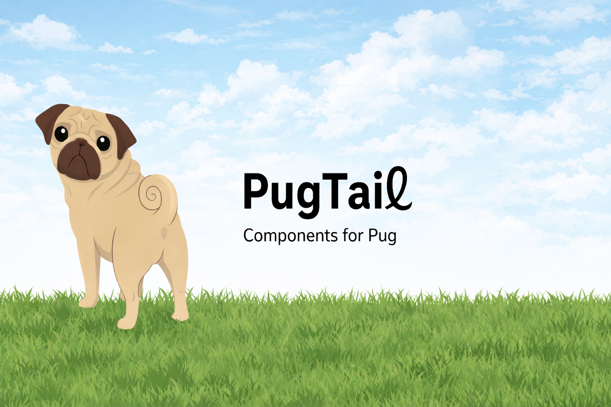

# pug-tail

A build tool that brings Vue/Svelte-like component syntax to Pug.



[](https://www.npmjs.com/package/pug-tail)
[](https://opensource.org/licenses/MIT)

[日本語 (Japanese)](README-ja.md)

### 🤖 Note on AI-Assisted Development

> [!NOTE]
> This is an **experimental project** developed heavily with the assistance of Large Language Models (LLMs).
>
> While functional, the codebase may contain unconventional solutions or require further refinement. Feedback and contributions are highly welcome.

## ✨ Features

- 🎯 **Multiple Named Slots** - Intuitive component syntax like Vue and Svelte.
- 📦 **Props/Attrs Separation** - Clear separation of props and attributes, inspired by Vue 3.
- ⚡ **Zero Runtime Cost** - Fully expanded at build time, generating a pure Pug AST.
- 🔄 **Control Flow Support** - Use `if`/`unless`/`each`/`while`/`case` within components.
- 🔧 **Pug Integration** - Works with other Pug features like `include`, `extends`, and `mixin`.
- 🚫 **No Runtime Extensions** - No modifications to Pug's runtime.
- ⚙️ **Powerful CLI** - Supports watch mode, configuration files, and data file loading.
- 📝 **Built with TypeScript** - Type-safe implementation and a great developer experience.

## 🌐 Live Demo

Explore pug-tail features in action:

- **[Main Demo](https://megurock.github.io/pug-tail/)** - Interactive examples and feature showcase
- **[CLI Guide](https://megurock.github.io/pug-tail/cli-guide.html)** - Complete CLI documentation
- **[Slots & Props](https://megurock.github.io/pug-tail/about.html)** - Advanced usage examples

## 🤔 Why pug-tail?

Pug's mixins can only accept a single content block, and named blocks are limited to `extends`. pug-tail solves this limitation at the AST level, enabling a component system with multiple named slots.

### Before (Pug's mixin limitation)

```pug
mixin Card()
  .card
    .card-header
      block
    .card-body
      // Multiple blocks are not possible
```

### After (pug-tail)

```pug
component Card()
  .card
    .card-header
      slot(header)
        p Default Header
    .card-body
      slot(body)
        p Default Body
    .card-footer
      slot(footer)
        p Default Footer

// Usage
Card()
  slot(header)
    h1 Title
  slot(body)
    p Content
  slot(footer)
    button OK
```

## 📦 Installation

```bash
npm install pug-tail
```

or

```bash
yarn add pug-tail
```

## 🚀 Quick Start

### Using the CLI

```bash
# Basic usage
npx pug-tail src/index.pug -o dist/index.html

# Convert a directory
npx pug-tail src -o dist

# Development with watch mode
npx pug-tail src -o dist -w

# Use with a data file
npx pug-tail src/index.pug -o dist/index.html --obj data.json

# Use a configuration file
npx pug-tail -c pugtail.config.js
```

**Key CLI Options**:
- `-o, --out <dir>` - Output directory or file
- `-w, --watch` - Watch mode (monitors file changes)
- `-c, --config <path>` - Path to the configuration file
- `--obj <path>` - Path to a data file (JSON/YAML)
- `--pretty` - Formats the HTML output
- `--basedir <path>` - Base directory for absolute includes
- `-d, --debug` - Enable debug output (shows details like component registration, slot detection, etc.)

#### Per-Page Data Files

You can load page-specific external data files using the `$dataFiles` directive within your entry Pug file.

```pug
// pages/index.pug
- const $dataFiles = ['/data/navigation.json', '/data/footer.json']

// Data from these files will be available
header
  each item in navigation
    a(href=item.url)= item.label
```

**Important Constraints**:
- Only available in entry files (top-level files being compiled).
- Cannot be used within included component files.
- Absolute paths (starting with `/`) are resolved relative to `basedir`.
- Relative paths are resolved relative to the entry file.

See the [Configuration Guide](./docs/CONFIGURATION.md) for more details.

### Programmatic API

```typescript
import { transform } from 'pug-tail'

const source = `
component Card()
  .card
    slot(header)
    slot(body)

Card()
  slot(header)
    h1 Hello
  slot(body)
    p World
`

const result = transform(source, { output: 'html' })
console.log(result.html)
```

## 📖 Component DSL

### Basic Usage

```pug
// Component Definition
component Card()
  .card
    .card-header
      slot(header)
        p Default Header
    .card-body
      slot(body)
        p Default Body

// Component Invocation
Card()
  slot(header)
    h1 Title
  slot(body)
    p Content
```

This DSL is expanded into pure Pug at build time to generate the final HTML.

### Key Features

#### Multiple Named Slots

Define multiple named slots, just like in Vue or Svelte.

```pug
component Layout()
  header
    slot(header)
  main
    slot(main)
  footer
    slot(footer)

Layout()
  slot(header)
    h1 My Site
  slot(main)
    p Content
  slot(footer)
    p © 2026
```

#### Props/Attrs Separation

Clear separation of props and attributes with `$props` and `$attrs`, inspired by Vue 3.

```pug
component Button()
  - const { label, type = "button" } = $props
  - const { class: className = "btn" } = $attrs
  button(type=type class=className)= label

Button(label="Submit", type="submit", class="btn-primary")
```

- Properties not declared in `$props` are automatically categorized into `$attrs`.
- Default values and renaming are also supported.

#### Automatic Attribute Fallthrough

Attributes passed to a component are automatically applied to the root element.

```pug
component Card()
  .card
    h2 Title

Card(class="my-card", id="card-1")
// → <div class="card my-card" id="card-1">...</div>
```

Manual control is also possible.

```pug
component Input()
  .wrapper
    input&attributes(attributes)

Input(type="text", class="primary")
// Attributes are applied to the input
```

#### Scope Isolation

Components have an isolated scope, preventing direct access to external variables.

```pug
// ❌ Error
- const message = 'Hello'
component Card()
  p= message

// ✅ Correct way: Pass via props
- const message = 'Hello'
component Card()
  - const { text } = $props
  p= text
Card(text=message)
```

### Detailed Documentation

The complete Component DSL documentation is here:

- [Component DSL Reference](./docs/COMPONENTS.md) - Complete reference guide
- [Configuration Guide](./docs/CONFIGURATION.md) - Configuration options

## 📚 Documentation

- [Configuration Guide](./docs/CONFIGURATION.md) - CLI options, configuration files, and data loading
- [Component DSL Reference](./docs/COMPONENTS.md) - Complete component syntax reference
- [Architecture](./docs/ARCHITECTURE.md) - Internal design and processing flow
- [Contributing](./docs/CONTRIBUTING.md) - Development setup and guidelines

## 🔧 Development

### Setup

```bash
# Install dependencies
npm install

# Build
npm run build

# Test
npm test

# Lint & Format
npm run check
```

### Contributing

Interested in contributing? Please see the [Contribution Guide](./docs/CONTRIBUTING.md).

## 📄 License

MIT License - see the [LICENSE](./LICENSE) file for details.

## 🙏 Acknowledgements

- [Pug](https://pugjs.org/) - The amazing template engine
- Inspired by the component system of [Vue.js](https://vuejs.org/)

---

**Status**: Alpha Release (v0.1.0-alpha.0) - 286 tests passing ✅